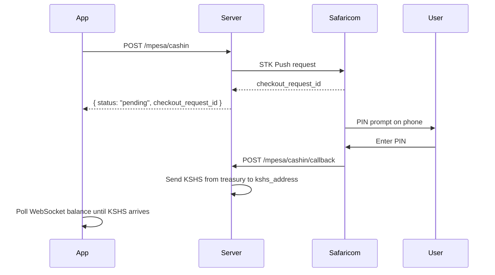
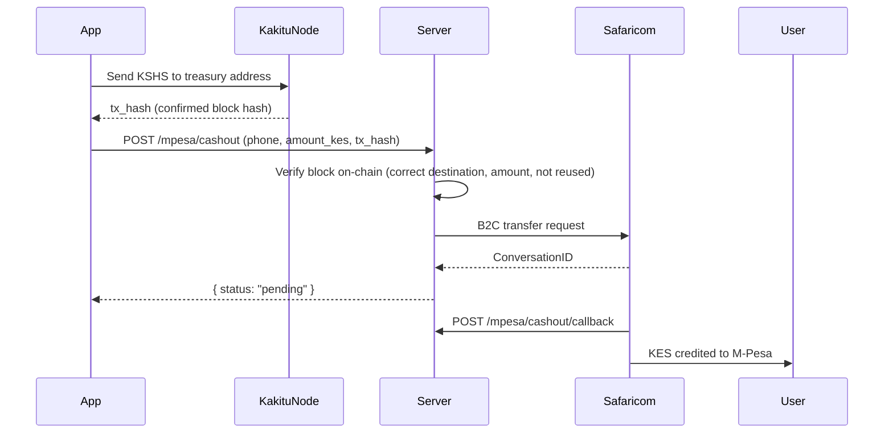

# Kakitu API Documentation Site Implementation Plan

> **For agentic workers:** REQUIRED SUB-SKILL: Use superpowers:subagent-driven-development (recommended) or superpowers:executing-plans to implement this plan task-by-task. Steps use checkbox (`- [ ]`) syntax for tracking.

**Goal:** Build and deploy a public Docusaurus 3 documentation site at `api.kakitu.org` covering the Kakitu wallet server HTTP API, WebSocket protocol, and M-Pesa integration.

**Architecture:** New standalone repo `kakitu-docs` scaffolded with Docusaurus 3 classic preset. `@scalar/docusaurus` plugin renders `openapi.yaml` as an interactive API reference. Six hand-written MDX doc pages cover narrative guides. Deployed to Vercel; `api.kakitu.org` CNAME points to it.

**Tech Stack:** Docusaurus 3, TypeScript, MDX, OpenAPI 3.1, `@scalar/docusaurus`, Vercel

---

## File Map

| Action | Path |
|--------|------|
| Create | `kakitu-docs/` (new repo root) |
| Create | `kakitu-docs/docusaurus.config.ts` |
| Create | `kakitu-docs/sidebars.ts` |
| Create | `kakitu-docs/tsconfig.json` |
| Create | `kakitu-docs/package.json` |
| Create | `kakitu-docs/openapi.yaml` |
| Create | `kakitu-docs/static/img/kakitu-logo.png` |
| Create | `kakitu-docs/src/css/custom.css` |
| Create | `kakitu-docs/docs/intro.md` |
| Create | `kakitu-docs/docs/getting-started.md` |
| Create | `kakitu-docs/docs/websocket.md` |
| Create | `kakitu-docs/docs/mpesa.md` |
| Create | `kakitu-docs/docs/alerts.md` |
| Create | `kakitu-docs/docs/errors.md` |
| Create | `kakitu-docs/vercel.json` |

---

## Task 1: Scaffold Docusaurus project and configure branding

**Files:**
- Create: `kakitu-docs/` (entire Docusaurus scaffold)
- Create: `kakitu-docs/src/css/custom.css`
- Create: `kakitu-docs/static/img/kakitu-logo.png`
- Create: `kakitu-docs/docusaurus.config.ts`
- Create: `kakitu-docs/sidebars.ts`

- [ ] **Step 1: Scaffold Docusaurus 3 in the kakitu directory**

Run from `/Users/kiptengwer/Documents/kakitu/`:
```bash
npx create-docusaurus@latest kakitu-docs classic --typescript
cd kakitu-docs
```
Expected: directory `kakitu-docs/` created with `package.json`, `docusaurus.config.ts`, `sidebars.ts`, `docs/`, `src/`, `static/`.

- [ ] **Step 2: Install Scalar plugin**

Run from `/Users/kiptengwer/Documents/kakitu/kakitu-docs/`:
```bash
npm install @scalar/docusaurus
```
Expected: `@scalar/docusaurus` added to `package.json` dependencies.

- [ ] **Step 3: Copy the Kakitu logo**

```bash
cp /Users/kiptengwer/Documents/kakitu/yellow-v2/src/assets/kakitu-logo.png \
   /Users/kiptengwer/Documents/kakitu/kakitu-docs/static/img/kakitu-logo.png
```
Expected: file exists at `static/img/kakitu-logo.png`.

- [ ] **Step 4: Replace `src/css/custom.css` with brand styles**

```css
/**
 * Kakitu brand colors — amber primary matching the explorer
 */
:root {
  --ifm-color-primary: #f0b429;
  --ifm-color-primary-dark: #d9a020;
  --ifm-color-primary-darker: #cc961e;
  --ifm-color-primary-darkest: #a87b18;
  --ifm-color-primary-light: #f2bc40;
  --ifm-color-primary-lighter: #f3c04d;
  --ifm-color-primary-lightest: #f6cc73;
  --ifm-code-font-size: 95%;
  --docusaurus-highlighted-code-line-bg: rgba(0, 0, 0, 0.1);
}

[data-theme='dark'] {
  --ifm-color-primary: #f0b429;
  --ifm-color-primary-dark: #d9a020;
  --ifm-color-primary-darker: #cc961e;
  --ifm-color-primary-darkest: #a87b18;
  --ifm-color-primary-light: #f2bc40;
  --ifm-color-primary-lighter: #f3c04d;
  --ifm-color-primary-lightest: #f6cc73;
  --docusaurus-highlighted-code-line-bg: rgba(0, 0, 0, 0.3);
}

.navbar__logo img {
  height: 32px;
}
```

- [ ] **Step 5: Replace `docusaurus.config.ts` with full config**

```typescript
import { themes as prismThemes } from 'prism-react-renderer';
import type { Config } from '@docusaurus/types';
import type * as Preset from '@docusaurus/preset-classic';

const config: Config = {
  title: 'Kakitu API',
  tagline: 'Developer documentation for the Kakitu wallet API',
  favicon: 'img/kakitu-logo.png',
  url: 'https://api.kakitu.org',
  baseUrl: '/',
  organizationName: 'kakitucurrency',
  projectName: 'kakitu-docs',
  onBrokenLinks: 'throw',
  onBrokenMarkdownLinks: 'warn',
  i18n: {
    defaultLocale: 'en',
    locales: ['en'],
  },
  plugins: [
    [
      '@scalar/docusaurus',
      {
        label: 'API Reference',
        route: '/api-reference',
        configuration: {
          spec: { url: '/openapi.yaml' },
          theme: 'saturn',
          darkMode: true,
        },
      },
    ],
  ],
  presets: [
    [
      'classic',
      {
        docs: {
          sidebarPath: './sidebars.ts',
          routeBasePath: '/docs',
        },
        blog: false,
        theme: {
          customCss: './src/css/custom.css',
        },
      } satisfies Preset.Options,
    ],
  ],
  themeConfig: {
    colorMode: {
      defaultMode: 'dark',
      disableSwitch: false,
      respectPrefersColorScheme: true,
    },
    navbar: {
      title: 'Kakitu API',
      logo: {
        alt: 'Kakitu Logo',
        src: 'img/kakitu-logo.png',
      },
      items: [
        {
          type: 'docSidebar',
          sidebarId: 'docs',
          position: 'left',
          label: 'Docs',
        },
        {
          to: '/api-reference',
          label: 'API Reference',
          position: 'left',
        },
        {
          href: 'https://kakitu.org',
          label: 'Explorer',
          position: 'right',
        },
        {
          href: 'https://github.com/kakitucurrency',
          label: 'GitHub',
          position: 'right',
        },
      ],
    },
    footer: {
      style: 'dark',
      links: [
        {
          title: 'Docs',
          items: [
            { label: 'Getting Started', to: '/docs/getting-started' },
            { label: 'WebSocket', to: '/docs/websocket' },
            { label: 'M-Pesa', to: '/docs/mpesa' },
          ],
        },
        {
          title: 'Kakitu',
          items: [
            { label: 'Explorer', href: 'https://kakitu.org' },
            { label: 'GitHub', href: 'https://github.com/kakitucurrency' },
          ],
        },
      ],
      copyright: `© ${new Date().getFullYear()} Kakitu. 1 KSHS = 1 KES.`,
    },
    prism: {
      theme: prismThemes.github,
      darkTheme: prismThemes.dracula,
      additionalLanguages: ['bash', 'json', 'yaml'],
    },
  } satisfies Preset.ThemeConfig,
};

export default config;
```

- [ ] **Step 6: Replace `sidebars.ts`**

```typescript
import type { SidebarsConfig } from '@docusaurus/plugin-content-docs';

const sidebars: SidebarsConfig = {
  docs: [
    'intro',
    'getting-started',
    'websocket',
    'mpesa',
    'alerts',
    'errors',
  ],
};

export default sidebars;
```

- [ ] **Step 7: Delete scaffold boilerplate**

Remove files the scaffold created that we don't need:
```bash
rm -rf docs/tutorial-basics docs/tutorial-extras docs/intro.md
rm -f src/pages/index.tsx src/pages/index.module.css
rm -f src/components/HomepageFeatures/index.tsx src/components/HomepageFeatures/styles.module.css
```

- [ ] **Step 8: Create minimal `src/pages/index.tsx` redirect**

```tsx
import { Redirect } from '@docusaurus/router';

export default function Home() {
  return <Redirect to="/docs/intro" />;
}
```

- [ ] **Step 9: Verify it builds**

```bash
npm run build 2>&1 | tail -10
```
Expected: `[SUCCESS] Generated static files in "build".` with no errors.

- [ ] **Step 10: Init git and commit**

```bash
git init
git add .
git commit -m "feat: scaffold Docusaurus with Kakitu branding and Scalar plugin"
```

---

## Task 2: Write the OpenAPI spec

**Files:**
- Create: `kakitu-docs/openapi.yaml`
- Create: `kakitu-docs/static/openapi.yaml` (copy — Scalar loads from static)

- [ ] **Step 1: Create `openapi.yaml` in repo root**

```yaml
openapi: 3.1.0
info:
  title: Kakitu Wallet API
  version: '1.0'
  description: |
    The Kakitu wallet server provides HTTP and WebSocket APIs for wallet operations,
    real-time updates, and M-Pesa cash-in/out.

    **Base URL:** `https://walletapi.kakitu.africa`

    **Rate limiting:** 100 requests/minute per IP. Pass `Authorization: <ADMIN_API_KEY>`
    to bypass.
  contact:
    url: https://kakitu.org

servers:
  - url: https://walletapi.kakitu.africa
    description: Production

tags:
  - name: Wallet
    description: Nano RPC proxy — wallet and account operations
  - name: M-Pesa
    description: Cash-in (STK Push) and cash-out (B2C) via Safaricom Daraja

paths:
  /api:
    post:
      tags: [Wallet]
      summary: Nano RPC Proxy
      description: |
        Unified endpoint for all wallet operations. Pass `action` in the request body
        to select the operation. Rate limited to 100 req/min per IP by default.

        All amounts are in **raw** units (1 KSHS = 10^30 raw).
      operationId: rpcProxy
      requestBody:
        required: true
        content:
          application/json:
            schema:
              oneOf:
                - $ref: '#/components/schemas/AccountBalanceRequest'
                - $ref: '#/components/schemas/AccountHistoryRequest'
                - $ref: '#/components/schemas/AccountInfoRequest'
                - $ref: '#/components/schemas/PendingRequest'
                - $ref: '#/components/schemas/ProcessRequest'
                - $ref: '#/components/schemas/BlockInfoRequest'
                - $ref: '#/components/schemas/AccountsBalancesRequest'
              discriminator:
                propertyName: action
            examples:
              account_balance:
                summary: Get account balance
                value:
                  action: account_balance
                  account: "kshs_1abc123..."
              account_history:
                summary: Get transaction history
                value:
                  action: account_history
                  account: "kshs_1abc123..."
                  count: 20
      responses:
        '200':
          description: RPC response (structure depends on action)
          content:
            application/json:
              schema:
                type: object
                description: Varies by action — see individual action schemas below
              examples:
                account_balance:
                  summary: account_balance response
                  value:
                    balance: "1000000000000000000000000000000"
                    pending: "0"
                    receivable: "0"
                account_history:
                  summary: account_history response
                  value:
                    account: "kshs_1abc123..."
                    history:
                      - type: send
                        account: "kshs_1dest..."
                        amount: "1000000000000000000000000000000"
                        local_timestamp: "1711900000"
                        height: "42"
                        hash: "ABC123..."
        '429':
          description: Rate limit exceeded

  /mpesa/config:
    get:
      tags: [M-Pesa]
      summary: Get M-Pesa config
      description: Returns the treasury address to which users send KSHS for cash-out.
      operationId: mpesaConfig
      responses:
        '200':
          description: M-Pesa configuration
          content:
            application/json:
              schema:
                type: object
                properties:
                  treasury_address:
                    type: string
                    description: The kshs_ address users send to for cash-out
                    example: "kshs_1treasury1abc123..."

  /mpesa/cashin:
    post:
      tags: [M-Pesa]
      summary: Initiate STK Push (cash-in)
      description: |
        Triggers an M-Pesa STK Push to the user's phone. On success, Safaricom
        prompts the user to enter their M-Pesa PIN. When the user pays, Safaricom
        calls the server callback and KSHS is sent to `kshs_address`.

        Poll the account balance on the WebSocket to detect when KSHS arrives.
      operationId: mpesaCashin
      requestBody:
        required: true
        content:
          application/json:
            schema:
              $ref: '#/components/schemas/CashinRequest'
            example:
              phone: "0712345678"
              amount_kes: "100"
              kshs_address: "kshs_1abc123..."
      responses:
        '200':
          description: STK Push initiated
          content:
            application/json:
              schema:
                $ref: '#/components/schemas/CashinResponse'
              example:
                status: pending
                checkout_request_id: "ws_CO_12032026123456789"
        '400':
          description: Invalid phone number, amount, or kshs_address
          content:
            application/json:
              schema:
                $ref: '#/components/schemas/ErrorResponse'

  /mpesa/cashout:
    post:
      tags: [M-Pesa]
      summary: Initiate B2C transfer (cash-out)
      description: |
        Sends KES to the user's M-Pesa phone after they have sent KSHS to the
        treasury address on-chain. The `tx_hash` must be the confirmed block hash
        of a send to `TREASURY_ADDRESS` with the exact `amount_kes` in KSHS.

        Each `tx_hash` can only be used once.
      operationId: mpesaCashout
      requestBody:
        required: true
        content:
          application/json:
            schema:
              $ref: '#/components/schemas/CashoutRequest'
            example:
              phone: "0712345678"
              amount_kes: "100"
              tx_hash: "ABC123DEF456..."
      responses:
        '200':
          description: B2C transfer initiated
          content:
            application/json:
              schema:
                $ref: '#/components/schemas/CashoutResponse'
              example:
                status: pending
        '400':
          description: Validation failure (invalid phone, amount mismatch, block not found, etc.)
          content:
            application/json:
              schema:
                $ref: '#/components/schemas/ErrorResponse'
        '409':
          description: tx_hash already used for a previous cashout
          content:
            application/json:
              schema:
                $ref: '#/components/schemas/ErrorResponse'

  /alerts/{lang}:
    get:
      tags: [Utility]
      summary: Get active alert
      description: Returns the active in-app alert for the given language. Used for maintenance banners.
      operationId: getAlert
      parameters:
        - name: lang
          in: path
          required: true
          schema:
            type: string
            example: en
          description: Language code (e.g. `en`, `sw`)
      responses:
        '200':
          description: Alert object (empty if no active alert)
          content:
            application/json:
              schema:
                type: object

components:
  schemas:
    AccountBalanceRequest:
      type: object
      required: [action, account]
      properties:
        action:
          type: string
          enum: [account_balance]
        account:
          type: string
          description: kshs_ address
          example: "kshs_1abc123..."

    AccountHistoryRequest:
      type: object
      required: [action, account]
      properties:
        action:
          type: string
          enum: [account_history]
        account:
          type: string
          example: "kshs_1abc123..."
        count:
          type: integer
          default: 1000
          maximum: 100000
          description: Number of blocks to return. Max 100000 with admin key.
        raw:
          type: boolean
          default: false
          description: Return amounts in raw units instead of KSHS

    AccountInfoRequest:
      type: object
      required: [action, account]
      properties:
        action:
          type: string
          enum: [account_info]
        account:
          type: string
          example: "kshs_1abc123..."

    PendingRequest:
      type: object
      required: [action, account]
      properties:
        action:
          type: string
          enum: [pending, receivable]
        account:
          type: string
          example: "kshs_1abc123..."
        count:
          type: integer
          default: 1000
        threshold:
          type: string
          description: Minimum amount in raw to include

    ProcessRequest:
      type: object
      required: [action, block, subtype]
      properties:
        action:
          type: string
          enum: [process]
        subtype:
          type: string
          enum: [send, receive, open, change]
        block:
          type: object
          description: Signed state block
          required: [type, account, previous, representative, balance, link, signature, work]
          properties:
            type:
              type: string
              enum: [state]
            account:
              type: string
            previous:
              type: string
            representative:
              type: string
            balance:
              type: string
              description: New balance in raw after this block
            link:
              type: string
              description: Destination address (send) or source hash (receive)
            signature:
              type: string
            work:
              type: string

    BlockInfoRequest:
      type: object
      required: [action, hash]
      properties:
        action:
          type: string
          enum: [block_info]
        hash:
          type: string
          example: "ABC123DEF456..."

    AccountsBalancesRequest:
      type: object
      required: [action, accounts]
      properties:
        action:
          type: string
          enum: [accounts_balances]
        accounts:
          type: array
          items:
            type: string
          example: ["kshs_1abc...", "kshs_1def..."]

    CashinRequest:
      type: object
      required: [phone, amount_kes, kshs_address]
      properties:
        phone:
          type: string
          description: "Accepted formats: `07XXXXXXXX`, `2547XXXXXXXX`, `+2547XXXXXXXX`"
          example: "0712345678"
        amount_kes:
          type: string
          description: Amount in KES (integer, minimum 1)
          example: "100"
        kshs_address:
          type: string
          description: The kshs_ address to receive KSHS after payment
          example: "kshs_1abc123..."

    CashinResponse:
      type: object
      properties:
        status:
          type: string
          enum: [pending]
        checkout_request_id:
          type: string
          description: Safaricom checkout ID. Use to track the transaction.

    CashoutRequest:
      type: object
      required: [phone, amount_kes, tx_hash]
      properties:
        phone:
          type: string
          example: "0712345678"
        amount_kes:
          type: string
          description: Amount in KES matching the on-chain KSHS send
          example: "100"
        tx_hash:
          type: string
          description: Block hash of the confirmed on-chain send to the treasury address
          example: "ABC123DEF456..."

    CashoutResponse:
      type: object
      properties:
        status:
          type: string
          enum: [pending]

    ErrorResponse:
      type: object
      properties:
        error:
          type: string
          example: "invalid phone number"

  securitySchemes:
    AdminKey:
      type: apiKey
      in: header
      name: Authorization
      description: Admin API key for elevated rate limits (100/min → unlimited)
```

- [ ] **Step 2: Copy spec to `static/` so Scalar can load it**

```bash
cp openapi.yaml static/openapi.yaml
```

- [ ] **Step 3: Build to verify spec loads**

```bash
npm run build 2>&1 | tail -5
```
Expected: `[SUCCESS] Generated static files in "build".`

- [ ] **Step 4: Quick smoke test — serve and open API reference**

```bash
npm run serve &
sleep 3
open http://localhost:3000/api-reference
```
Expected: Scalar UI loads, shows "Kakitu Wallet API" with endpoints listed.

- [ ] **Step 5: Commit**

```bash
git add openapi.yaml static/openapi.yaml
git commit -m "feat: add OpenAPI 3.1 spec for all HTTP endpoints"
```

---

## Task 3: Write the doc pages

**Files:**
- Create: `kakitu-docs/docs/intro.md`
- Create: `kakitu-docs/docs/getting-started.md`
- Create: `kakitu-docs/docs/websocket.md`
- Create: `kakitu-docs/docs/mpesa.md`
- Create: `kakitu-docs/docs/alerts.md`
- Create: `kakitu-docs/docs/errors.md`

- [ ] **Step 1: Create `docs/intro.md`**

```markdown
---
sidebar_position: 1
slug: /docs/intro
---

# Introduction

Kakitu is a **1 KSHS = 1 KES stablecoin** built on a fork of the Nano blockchain protocol.
Transactions are feeless and settle in under a second.

## What the API provides

| Feature | How |
|---------|-----|
| Wallet operations | `POST /api` — balance, history, send/receive blocks |
| Real-time updates | WebSocket — live balance, price, incoming block notifications |
| M-Pesa cash-in | `POST /mpesa/cashin` — STK Push, user pays KES → receives KSHS |
| M-Pesa cash-out | `POST /mpesa/cashout` — user sends KSHS → receives KES on M-Pesa |
| Alerts | `GET /alerts/{lang}` — in-app maintenance banners |

## Base URL

```
https://walletapi.kakitu.africa
```

## Quick start

```bash
curl -X POST https://walletapi.kakitu.africa/api \
  -H "Content-Type: application/json" \
  -d '{"action":"account_balance","account":"kshs_1abc123..."}'
```

Response:
```json
{
  "balance": "1000000000000000000000000000000",
  "pending": "0",
  "receivable": "0"
}
```

:::info
All balances are in **raw** units. 1 KSHS = 10³⁰ raw.
:::

Next: [Getting Started →](./getting-started)
```

- [ ] **Step 2: Create `docs/getting-started.md`**

```markdown
---
sidebar_position: 2
---

# Getting Started

## Base URL

```
https://walletapi.kakitu.africa
```

## Content-Type

All `POST` requests must include:
```
Content-Type: application/json
```

## Rate Limiting

| Tier | Limit |
|------|-------|
| Default | 100 requests / minute per IP |
| Admin key | Unlimited |

To use the admin tier, pass the key in the `Authorization` header:
```
Authorization: YOUR_ADMIN_API_KEY
```

## CORS

All origins are allowed. No preflight configuration needed.

## Amounts

All KSHS amounts in the API are in **raw** units:

```
1 KSHS = 1,000,000,000,000,000,000,000,000,000,000 raw  (10³⁰)
```

To convert:
```js
const KSHS_TO_RAW = BigInt('1000000000000000000000000000000'); // 10^30
const raw = BigInt(kshs) * KSHS_TO_RAW;
const kshs = Number(raw) / Number(KSHS_TO_RAW);
```

## Address format

All Kakitu addresses start with `kshs_`:
```
kshs_1abc123def456...
```

## Example: Check balance

```bash
curl -X POST https://walletapi.kakitu.africa/api \
  -H "Content-Type: application/json" \
  -d '{
    "action": "account_balance",
    "account": "kshs_1abc123..."
  }'
```

## Example: Get transaction history

```bash
curl -X POST https://walletapi.kakitu.africa/api \
  -H "Content-Type: application/json" \
  -d '{
    "action": "account_history",
    "account": "kshs_1abc123...",
    "count": 10
  }'
```

See the [API Reference](/api-reference) for all available actions.
```

- [ ] **Step 3: Create `docs/websocket.md`**

```markdown
---
sidebar_position: 3
---

# WebSocket

The WebSocket endpoint provides real-time balance updates, price feeds, and block notifications.

## Endpoint

```
wss://walletapi.kakitu.africa
```

## Keepalive

The server sends a WebSocket ping every **54 seconds**. Your client must respond with a pong within 60 seconds or the connection is closed. Most WebSocket libraries handle pong automatically.

## Subscribing to an account

Send an `account_subscribe` message after connecting:

```js
const ws = new WebSocket('wss://walletapi.kakitu.africa');

ws.onopen = () => {
  ws.send(JSON.stringify({
    action: 'account_subscribe',
    account: 'kshs_1abc123...',
    currency: 'KES',
    fcm_token_v2: '<firebase-token>',       // optional
    notification_enabled: true,             // optional
  }));
};

ws.onmessage = (event) => {
  const data = JSON.parse(event.data);
  console.log(data);
};
```

### Subscribe request fields

| Field | Type | Required | Description |
|-------|------|----------|-------------|
| `action` | string | ✅ | Must be `account_subscribe` |
| `account` | string | ✅ | `kshs_` address to subscribe to |
| `currency` | string | | ISO currency code for price (default: `USD`). Use `KES` for Kenyan Shilling. |
| `uuid` | string | | Client session ID. Auto-generated if omitted. |
| `fcm_token_v2` | string | | Firebase Cloud Messaging token for push notifications |
| `notification_enabled` | boolean | | `true` to store FCM token, `false` to remove it |

### Subscribe response fields

| Field | Type | Description |
|-------|------|-------------|
| `account` | string | Subscribed address |
| `balance` | string | Current balance in raw |
| `frontier` | string | Latest block hash |
| `representative` | string | Current representative address |
| `open_block` | string | First block hash (null if unopened) |
| `confirmation_height` | number | Confirmed block height |
| `block_count` | number | Total block count |
| `pending_count` | number | Number of pending (unreceived) blocks |
| `price` | string | Current KSHS price in requested currency |
| `btc` | string | Current KSHS price in BTC |
| `currency` | string | Currency code |
| `uuid` | string | Session ID |

## Updating FCM token

To update push notification preferences without re-subscribing:

```js
ws.send(JSON.stringify({
  action: 'fcm_update',
  account: 'kshs_1abc123...',
  fcm_token_v2: '<new-firebase-token>',
  enabled: true,
}));
```

| Field | Type | Description |
|-------|------|-------------|
| `action` | string | Must be `fcm_update` |
| `account` | string | Address to update token for |
| `fcm_token_v2` | string | New FCM token |
| `enabled` | boolean | `true` = store token, `false` = remove token |

## Real-time server events

### Price update

Sent every 60 seconds to all connected clients:

```json
{
  "currency": "KES",
  "price": "1.00",
  "btc": "0.000000089"
}
```

### Incoming block notification

Sent when a send block targets your subscribed account:

```json
{
  "account": "kshs_1abc123...",
  "hash": "DEF456...",
  "block": { ... },
  "is_send": "true",
  "amount": "1000000000000000000000000000000"
}
```

The `amount` is in raw units. This notification is sent alongside a Firebase push notification if the account has a registered FCM token.
```

- [ ] **Step 4: Create `docs/mpesa.md`**

````markdown
---
sidebar_position: 4
---

# M-Pesa Integration

Kakitu supports M-Pesa cash-in (KES → KSHS) and cash-out (KSHS → KES) via the Safaricom Daraja API.

## Cash-in (KES → KSHS)

The user pays KES via M-Pesa STK Push and receives KSHS at their wallet address.



### Request

```bash
curl -X POST https://walletapi.kakitu.africa/mpesa/cashin \
  -H "Content-Type: application/json" \
  -d '{
    "phone": "0712345678",
    "amount_kes": "100",
    "kshs_address": "kshs_1abc123..."
  }'
```

**Phone formats accepted:** `07XXXXXXXX` · `2547XXXXXXXX` · `+2547XXXXXXXX`

### Response

```json
{
  "status": "pending",
  "checkout_request_id": "ws_CO_12032026123456789"
}
```

### Detecting completion

Connect to the WebSocket and subscribe to your account. When KSHS arrives, you will receive a block notification:

```js
ws.onmessage = (event) => {
  const msg = JSON.parse(event.data);
  if (msg.account && msg.amount) {
    // Incoming KSHS block — refresh balance
  }
};
```

---

## Cash-out (KSHS → KES)

The user sends KSHS to the treasury address on-chain, then calls the cashout endpoint with the transaction hash.



### Step 1 — Get the treasury address

```bash
curl https://walletapi.kakitu.africa/mpesa/config
```

Response:
```json
{ "treasury_address": "kshs_1treasury..." }
```

### Step 2 — Send KSHS on-chain

Use your wallet to send exactly `amount_kes` KSHS to the treasury address. Wait for confirmation and note the block hash.

### Step 3 — Request cash-out

```bash
curl -X POST https://walletapi.kakitu.africa/mpesa/cashout \
  -H "Content-Type: application/json" \
  -d '{
    "phone": "0712345678",
    "amount_kes": "100",
    "tx_hash": "ABC123DEF456..."
  }'
```

Response:
```json
{ "status": "pending" }
```

### Validations

The server verifies before sending KES:
- Block exists and is confirmed on-chain
- Block destination = treasury address
- Block subtype = `send`
- Block amount matches `amount_kes` (1 KES = 1 KSHS)
- `tx_hash` has not been used before (double-spend protection)

---

## Sandbox

Set `MPESA_ENVIRONMENT=sandbox` on the server to use Safaricom's test environment (shortcode `174379`). Callbacks from Safaricom in sandbox mode are simulated and may not reflect real payment completion.
````

- [ ] **Step 5: Create `docs/alerts.md`**

```markdown
---
sidebar_position: 5
---

# Alerts

The alerts endpoint returns active in-app announcements — used for maintenance notices, upgrade prompts, or emergency messages.

## Endpoints

```
GET /alerts/{lang}
GET /alerts/
```

`/alerts/` returns the English alert. `/alerts/{lang}` returns the alert for the given language code.

## Example

```bash
curl https://walletapi.kakitu.africa/alerts/en
```

If there is no active alert, the response is an empty object `{}`.

## Alert object

The structure of the alert object is defined by the server's `alerts.json` configuration file. A typical alert includes a title, message, and optional action button.
```

- [ ] **Step 6: Create `docs/errors.md`**

```markdown
---
sidebar_position: 6
---

# Errors

## HTTP status codes

| Status | Meaning |
|--------|---------|
| `200` | Success |
| `400` | Bad Request — invalid input (see message for details) |
| `409` | Conflict — `tx_hash` already used for a cashout |
| `429` | Too Many Requests — rate limit exceeded (100 req/min per IP) |
| `500` | Internal Server Error — upstream Nano RPC or Daraja failure |

## Error response format

```json
{
  "error": "invalid phone number"
}
```

## Common 400 errors

| Endpoint | Cause |
|----------|-------|
| `POST /mpesa/cashin` | Phone not in accepted format |
| `POST /mpesa/cashin` | `amount_kes` is zero or negative |
| `POST /mpesa/cashin` | `kshs_address` does not start with `kshs_` |
| `POST /mpesa/cashout` | Block not found or not confirmed |
| `POST /mpesa/cashout` | Block destination is not the treasury address |
| `POST /mpesa/cashout` | Block amount does not match `amount_kes` |

## WebSocket disconnections

| Cause | Description |
|-------|-------------|
| Ping timeout | Client did not respond to server ping within 60 seconds |
| Server restart | Reconnect with exponential backoff |

Reconnection example:

```js
function connect() {
  const ws = new WebSocket('wss://walletapi.kakitu.africa');
  ws.onclose = () => setTimeout(connect, 2000);
  ws.onopen = () => { /* re-subscribe */ };
}
connect();
```
```

- [ ] **Step 7: Build to verify all pages compile**

```bash
npm run build 2>&1 | tail -10
```
Expected: `[SUCCESS] Generated static files in "build".` with no errors. If there are broken link errors, check the `slug` values in frontmatter match the sidebar entries.

- [ ] **Step 8: Commit**

```bash
git add docs/
git commit -m "feat: add all six documentation pages"
```

---

## Task 4: Deploy to Vercel and wire domain

**Files:**
- Create: `kakitu-docs/vercel.json`

- [ ] **Step 1: Create `vercel.json`**

```json
{
  "buildCommand": "npm run build",
  "outputDirectory": "build",
  "framework": null
}
```

- [ ] **Step 2: Create GitHub repo and push**

```bash
git remote add origin git@github.com:kakitucurrency/kakitu-docs.git
git branch -M main
git push -u origin main
```
Expected: repo visible at `github.com/kakitucurrency/kakitu-docs`.

- [ ] **Step 3: Deploy to Vercel**

1. Go to [vercel.com/new](https://vercel.com/new)
2. Click **Import Git Repository** → select `kakitucurrency/kakitu-docs`
3. Framework Preset: **Other**
4. Build Command: `npm run build`
5. Output Directory: `build`
6. Click **Deploy**

Expected: deployment succeeds, Vercel provides a URL like `kakitu-docs.vercel.app`.

- [ ] **Step 4: Add custom domain in Vercel**

1. In the Vercel project → **Settings** → **Domains**
2. Add `api.kakitu.org`
3. Vercel shows the required DNS record:
   ```
   Type: CNAME
   Name: api
   Value: cname.vercel-dns.com
   ```

- [ ] **Step 5: Add DNS record**

In the kakitu.org DNS zone (wherever it's managed — Cloudflare, Namecheap, etc.), add:
```
Type:  CNAME
Name:  api
Value: cname.vercel-dns.com
TTL:   300
```
Expected: within 5 minutes, `api.kakitu.org` loads the docs site with a valid TLS certificate.

- [ ] **Step 6: Smoke test the live site**

Open each of these URLs and verify they load:
- `https://api.kakitu.org` → redirects to `/docs/intro`
- `https://api.kakitu.org/docs/intro` → Introduction page
- `https://api.kakitu.org/docs/getting-started` → Getting Started page
- `https://api.kakitu.org/docs/websocket` → WebSocket page
- `https://api.kakitu.org/docs/mpesa` → M-Pesa page with Mermaid diagrams
- `https://api.kakitu.org/api-reference` → Scalar interactive reference with all endpoints

- [ ] **Step 7: Commit vercel.json and final push**

```bash
git add vercel.json
git commit -m "feat: add vercel.json for deployment config"
git push origin main
```
